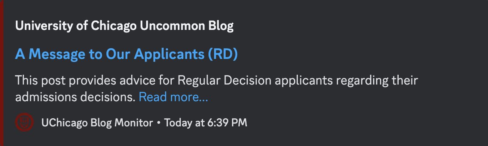

<div align="center">

<h1 align="center">UChicago Uncommon Blog Monitor</h1>
<h3>Monitor for new blog posts on UChicago's Uncommon Blog</h3>

</div>
<br/>

I created this helpful monitor to be instantly alerted of new blog posts on UChicago's Uncommon Blog for updates on the Early Decision release date! Just follow the instructions below to get started!

---

## Environment

#### **_`.env` supported_**

- `DISCORD_WEBHOOK_URL` - Discord webhook to send updates to

## Run

```sh
$ go run .
```

---

## License

Distributed under the GNU GPL v3.0 License. See `LICENSE` for more information.